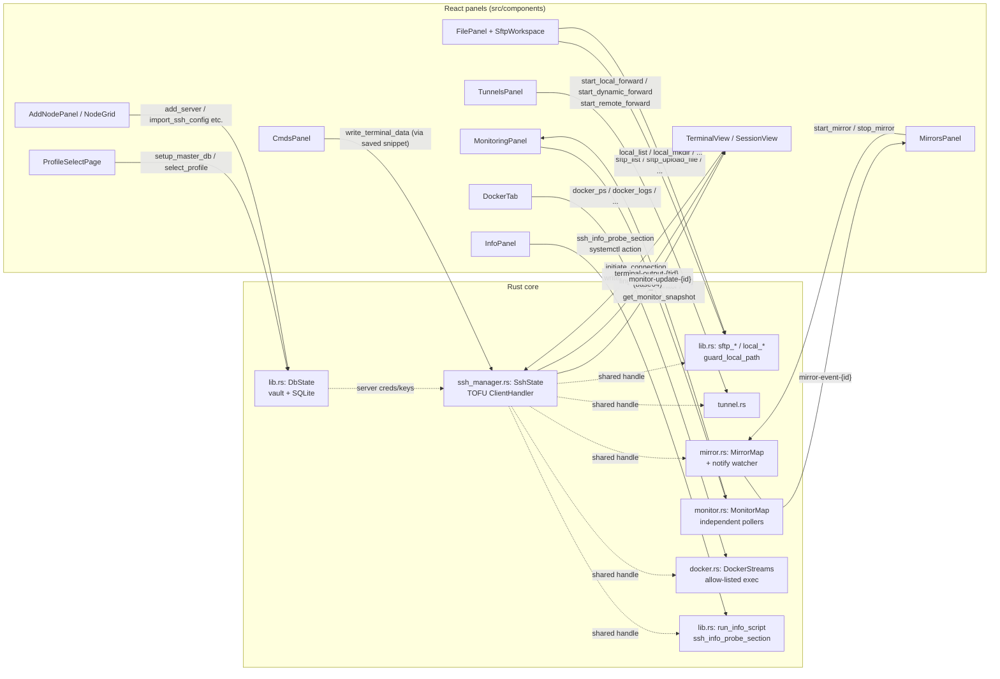

# Architecture

SSHClientX is a Tauri 2 desktop/mobile app: a React webview (UI only) driving
a Rust core (all privilege) over Tauri's IPC bridge. There is no backend —
the vault is a single encrypted file on disk, and every feature (SSH,
SFTP, tunnels, mirror, Docker, monitoring) is implemented as Rust
`#[tauri::command]`s called from React. See `AGENTS.md` for contributor-facing
conventions (naming, error prefixes, dev commands); this doc is the "how it
fits together" picture.

## High-level shape

```
                     ┌─────────────────────────────────────────┐
                     │              Webview (React)             │
                     │  DesktopApp.tsx ── owns top-level state  │
                     │  components/*   ── one per feature panel │
                     │  fs/*           ── FileProvider abstraction│
                     └───────────────┬───────────────────────────┘
                       invoke(cmd)   │   listen(event)
                     ┌───────────────▼───────────────────────────┐
                     │        Tauri IPC (JSON commands +          │
                     │        typed events, no network origin)    │
                     └───────────────┬───────────────────────────┘
                     ┌───────────────▼───────────────────────────┐
                     │           Rust core (lib.rs::run())        │
                     │  ┌────────┐ ┌──────────┐ ┌──────┐ ┌──────┐│
                     │  │ vault  │ │ssh_manager│ │tunnel│ │mirror││
                     │  │(lib.rs)│ │  (TOFU)   │ │      │ │      ││
                     │  └────────┘ └──────────┘ └──────┘ └──────┘│
                     │  ┌────────┐ ┌──────────┐ ┌──────┐ ┌──────┐│
                     │  │monitor │ │  docker   │ │ hlc  │ │about ││
                     │  └────────┘ └──────────┘ └──────┘ └──────┘│
                     └───────────────┬───────────────────────────┘
                                     │
                     ┌───────────────▼───────────────────────────┐
                     │  <app_data>/profiles/<name>.sshclientx      │
                     │  SQLite serialize → zstd → AES-256-GCM      │
                     │  (Argon2id-derived key, never touches disk) │
                     └─────────────────────────────────────────────┘
```

Everything privileged (crypto, SSH/SFTP via `russh`, local filesystem
mutation, port forwarding, Docker exec) lives in Rust. The webview never
sees plaintext credentials outside of what a command's return value hands
it for display.

## Entry points & process model

- `src-tauri/src/main.rs` — one-liner, calls `sshclientx_lib::run()`. Not
  built on Android (Tauri's `#[cfg_attr(mobile, tauri::mobile_entry_point)]`
  on `run()` generates the JNI glue instead).
- `src-tauri/src/lib.rs::run()` (line ~8330) — the actual composition root:
  builds the `tauri::Builder`, registers plugins (`tauri-plugin-opener`,
  desktop-only `tauri-plugin-window-state`), calls `.manage()` for every
  piece of shared state, and lists all `#[tauri::command]`s in
  `generate_handler!`.
- Single binary target for desktop (Windows/macOS/Linux); same `run()` is
  reused for the Android `cdylib` that Gradle `dlopen`s from the APK.
  Desktop-only crates (`rfd`, `open`, `tauri-plugin-window-state`) are
  `cfg(not(target_os = "android"))`-gated in `Cargo.toml` and at call sites.

## Features

Every panel in the sidebar maps to one Rust module/state and, apart from
the vault and local-FS side of SFTP, rides on top of a single shared
`russh` session per open tab (`SshState`) — opening a session doesn't open
a new SSH connection per feature.



- **Vault/profiles** (`ProfileSelectPage`, `AddNodePanel`, `NodeGrid`) —
  the only feature that doesn't need a live SSH connection; everything else
  reads server rows out of the same `DbState` SQLite connection to get host/
  auth material.
- **Terminal** (`TerminalView`/`SessionView`) — opens the session's
  `SshState` entry via `initiate_connection`, then it's a raw byte pipe:
  `write_terminal_data` in, `terminal-output-{tid}` (base64) out.
- **SFTP** (`FilePanel` × 2 via `fs/localProvider.ts` / `remoteProvider.ts`)
  — remote side reuses the session's SSH handle for an SFTP subchannel;
  local side goes through `guard_local_path`-gated FS commands. Cross-pane
  transfers stream file-to-file in Rust, never through the JS heap.
  Import Server (`AddNodePanel`) reuses the same guarded path parsing to
  read `~/.ssh/config`, PuTTY registry exports, and MobaXterm session files.
- **Tunnels** (`TunnelsPanel`) — L/D/R forwards layered on the same
  `SshState` handle as the terminal, so closing the terminal tears down its
  tunnels too.
- **Mirror** (`MirrorsPanel`) — two-way folder sync; owns its own
  `notify`-debounced watcher and `MirrorMap` entry independent of terminal
  lifecycle, so a mirror can keep running with the terminal tab closed.
- **Monitoring** (`MonitoringPanel`) — deliberately *not* on the shared
  `SshState` handle: each monitored node gets its own poller connection in
  `MonitorMap` so a stalled poll can't block an interactive session.
- **Docker** (`DockerTab`) — `docker` CLI invoked over SSH exec on the
  shared handle, allow-listed verbs only (no `rm`/`remove`/`down`).
- **Info/Cmds** (`InfoPanel`, `CmdsPanel`) — `InfoPanel` runs read-only
  system-probe scripts (disk/CPU/services) plus gated `systemctl` actions
  over exec; `CmdsPanel` is just a saved-snippet launcher that writes into
  the same terminal byte pipe as manual typing.

## Frontend (`src/`)

React 18 + TypeScript (strict) + Tailwind, no state library — plain
`useState`/`useCallback` plus a couple of small context providers
(`ui/broadcast.tsx` for multi-session command fan-out, `ui/confirm.tsx` for
modal confirm/prompt dialogs). No React Router; view switching is a
`activeView` string in `DesktopApp.tsx`.

| Path | Responsibility |
|---|---|
| `main.tsx`, `App.tsx` | Bootstrap, error boundary wiring |
| `DesktopApp.tsx` (2.5k lines) | Top-level shell: profile unlock → sidebar/session-tab state, session lifecycle, window sizing |
| `components/ProfileSelectPage.tsx` | Vault selection + unlock (`select_profile`/`setup_master_db`) |
| `components/SessionView.tsx`, `TerminalView.tsx` | Per-session terminal (xterm.js) + tab chrome |
| `components/FilePanel.tsx`, `SftpWorkspace.tsx` | Dual-pane file browser, mounted twice against different `FileProvider`s |
| `components/TunnelsPanel.tsx`, `MirrorsPanel.tsx`, `MonitoringPanel.tsx`, `DockerTab.tsx`, `CmdsPanel.tsx`, `InfoPanel.tsx` | One panel per backend feature module |
| `components/AddNodePanel.tsx`, `NodeGrid.tsx`, `Sidebar.tsx` | Server inventory CRUD/browse |
| `fs/` | `FileProvider` interface (`types.ts`) with `localProvider.ts` / `remoteProvider.ts` implementations; `transfer.ts` handles cross-pane copy without routing bytes through JS |
| `hooks/useTauriListen.ts` | Typed wrapper over Tauri's `listen()` for the `kebab-case-{id}` event convention |
| `util/platform.ts` | `IS_ANDROID`, narrow-viewport detection |

The `FileProvider` abstraction (`src/fs/types.ts`) is the one real
architectural seam on the frontend: `FilePanel` is backend-agnostic and
mounted once per pane with either a local or remote provider, so local
Explorer-style browsing and SFTP browsing share one UI implementation.
Transfers between panes bypass the provider interface (`fs/transfer.ts`)
so remote↔local copies use dedicated `sftp_*`/`local_*` streaming commands
instead of buffering through a `Uint8Array` in JS.

## Rust core (`src-tauri/src/`)

`lib.rs` (8.5k lines) is intentionally the majority of the backend — it
owns the vault, the SQLite schema/sync-trigger machinery, and most
`#[tauri::command]`s (114 of the crate's ~131). The other modules are
split out because they carry meaningfully separate state or protocol
concerns:

| Module | Owns |
|---|---|
| `lib.rs` | `DbState`, vault open/save/migrate (Argon2id → AES-256-GCM → zstd), SQLite schema + HLC-stamped sync triggers (dormant, kept for backward-compatible reads — see below), SSH connection setup, SFTP file ops, local FS ops (`guard_local_path`), server-config import (ssh config / PuTTY / MobaXterm), most commands |
| `ssh_manager.rs` | `SshState` (live `russh` handle map) + the TOFU `ClientHandler` (host-key verify → `fingerprint-prompt-{sid}` event → `verify_fingerprint_response`) |
| `tunnel.rs` | Local/dynamic/remote port forwards over a session's `SshState` handle |
| `mirror.rs` | Two-way local↔remote folder sync + `notify`-based watcher; `MirrorMap` state; `.submarine-trash`/`.submarine-tmp` naming kept for compat |
| `monitor.rs` | Independent SSH pollers for the monitoring dashboard (`MonitorMap`) — separate connections from the interactive `SshState`, so a laggy monitor poll can't stall a terminal |
| `docker.rs` | Allow-listed `docker` invocation over SSH exec (`DockerStreams`); explicitly excludes destructive verbs (`rm`, `remove`, `down`) |
| `hlc.rs` | Hybrid logical clock — stamps `updated_at` for local conflict-free ordering; nothing remote consumes it now that sync is gone |
| `about.rs` | App version + GitHub release check (`InDieStack-v2/SSHClientX`) |

### Why sync/HLC code is still here

The commit history shows `3cc92c4` removed accounts, cloud sync, and
profile sharing (local-only pivot — see `specs/001-local-only-mode/` and
`.specify/memory/constitution.md` Principle I). The HLC-stamped columns
(`uuid`, `updated_at`, `deleted`, `edited_by`) and their SQLite triggers
were kept rather than dropped, because they're needed to read vaults
written before the pivot and because the same trigger set also stamps
local edit metadata that's still displayed in the UI. They are not wired
to any network path — there is nothing left to sync with.

### Vault format

```
plaintext (SQLite serialize) → zstd compress → AES-256-GCM encrypt → write
```

- Key derivation: Argon2id, `m_cost=64MiB, t=3, p=4` (frozen — a param
  change needs a versioned re-key migration per the constitution).
- File magic `OMNV`; on-disk extension `.sshclientx` (write), still reads
  legacy `.submarine` files.
- Master key lives in `DbState` behind a `Zeroizing` wrapper; Argon2 and
  vault serialize/encrypt run on `spawn_blocking`, never on the async
  runtime, and the SQLite `Mutex` is never held across an `.await`.

### State management

Tauri-managed state, set up once in `run()`:

- `DbState` — SQLite connection + master key/salt/active-profile, guarded
  by `std::sync::Mutex` (not tokio's — see async rule above).
- `SshState` (`ssh_manager.rs`) — live interactive SSH sessions.
- `MirrorMap` (`mirror.rs`) — active two-way sync watchers, keyed by
  session id.
- `MonitorMap` (`monitor.rs`) — active dashboard pollers, keyed by node id.
- `DockerStreams` (`docker.rs`) — in-flight Docker exec streams.

UI-only preferences (terminal colors/font, SFTP pane layout) live in
`localStorage` under `sshclientx-*` keys — nothing security-sensitive is
ever persisted there.

## IPC conventions

- Commands: `snake_case` name, `camelCase` args —
  `invoke("initiate_connection", { sessionId, serverId })`.
- Events: `kebab-case-{id}` — e.g. `terminal-output-{tid}`,
  `fingerprint-prompt-{sid}`. Terminal output is base64-encoded, not a raw
  byte-array (a JSON number array bloats ~4x over the wire).
- Errors: `Result<T, String>`, string-prefixed by subsystem — `[SYSTEM]
  [CRYPTO] [VAULT] [DATABASE] [STATE] [FILE] [SSH] [UPDATE] [OPEN]`. A few
  commands use the error channel as a structured signal the frontend
  parses (`EXISTS:<path>` on an SFTP overwrite probe, retried with
  `overwrite: true`; wrong vault password surfaces as `[CRYPTO]
  DECRYPT_FAILURE`).

## Security boundary

- **Capabilities** (`src-tauri/capabilities/`): no `shell:*`, `fs:*`, or
  `webview:*` — the webview can't reach those plugin APIs even if
  compromised. `default.json` is the cross-platform ACL; desktop-only
  `window-state:default` is split into `desktop.json` so Android capability
  validation doesn't fail on a plugin that isn't compiled in for that
  target.
- **CSP** (`tauri.conf.json`): `script-src 'self'`, `connect-src 'self'
  ipc: https://ipc.localhost` (no network origin — there's no backend to
  allow-list), `frame-src`/`object-src 'none'`.
- **Path guards**: `guard_local_path`, `is_safe_dir_entry_name`,
  `safe_temp_leaf_name`, `app_temp_root` gate every local filesystem
  command against traversal. Docker commands go through `shq`/`is_safe_name`
  — no string-built `sh -c`.
- **TOFU host-key verification**: `ssh_manager::ClientHandler` blocks a new
  connection on a `fingerprint-prompt-{sid}` event until the frontend calls
  `verify_fingerprint_response`. Monitor pollers deliberately skip this UX
  and only trust `known_hosts`, since they run unattended.
- **No egress**: no analytics/telemetry/crash reporting, no account or
  cloud API. `open_external_url` is restricted to http(s).

## Build targets & feature flags

- Default `cargo build`/`npm run tauri dev` is OpenSSL-free (`russh`'s
  built-in crypto), trading some SSH compatibility (no legacy RSA host
  keys / old KEX) for a Perl-free local dev build.
- `--features full-ssh-algos` (used by release CI and `npm run
  android:build`) links a vendored OpenSSL for full RSA/legacy-KEX/HMAC-SHA1
  support, at the cost of needing Perl + a C compiler on the build host.
- Android uses the same `run()` via `mobile_entry_point`; desktop-only
  crates/plugins are compiled out via `cfg(not(target_os = "android"))`.

## Testing

Rust `#[cfg(test)]` only (~18 tests, no JS test runner): HLC ordering,
local sync-trigger stamping, tunnel bind/pump, SFTP path-traversal safety.
Not covered: UI, live SSH/TOFU, vault disk I/O, mirror, Docker, monitor,
Android — those get manual smoke-tested via `npm run tauri dev` /
`npm run android:dev`. See `AGENTS.md` § Testing & QA for exact commands.

## Where to look for more detail

- `AGENTS.md` — conventions, dev commands, compat-freeze list.
- `.specify/memory/constitution.md` — the five non-negotiable principles
  this architecture is constrained by.
- `specs/001-local-only-mode/` — why accounts/cloud-sync/sharing were
  removed.
- `docs/features/spec-00-e2e-vault.md` — the (not-yet-built) vault vNext
  direction: DEK/KEK split, QR device pairing, bring-your-own-cloud backup.
  Still a real future target, not a stale doc.
